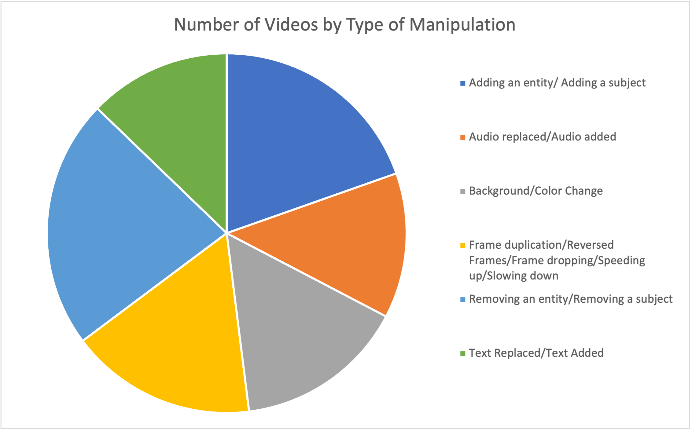

# VideoSham Dataset

#### This repository provides data for the VideoSham Dataset as described in the paper titled, "Video Manipulations Beyond Faces: A Dataset with Human-Machine Analysis". The paper can be found <a href="https://arxiv.org/abs/2207.13064">here</a>.

## Dataset Description
VideoSham is a video manipulation dataset; consisting of diverse, context-rich, and human-centric manipulated videos by professional video editors via 6 spatial and temporal attacks. VideoSham consists of 352 real-world videos and their corresponding manipulated versions (total of 704 videos). We worked with 3 professional video editors hired on <a href="www.upwork.com">Upwork</a>. The editors were shortlisted based on their experience and a trial video editing task. All editors were well-versed with Adobe AfterEffects; the software used for creating these edits. Each editor was assigned tasks, i.e., source videos, start and end timestamp to be edited and a one-line description of the manipulation to be performed. The original videos were selected from <a href="www.vimeo.com">Vimeo</a>. All original videos provide <a href="https://creativecommons.org/licenses/by/4.0/">CC-BY</a> usage rights. The source of the original videos can be found [here](VideoSourceandEdits.csv). 

Given the original videos, we first *trimmed* it to a shorter length (average length of 8 seconds), then we assigned one of the editors the task of editing it. We identified one of six possible manipulation strategies to simulate the effect of misrepresenting facts, these are described below.  


1. **ATTACK 1 (Adding an entity/subject):** In this attack we select an entity or a subject from some other sources and place them in the current video.

2. **ATTACK 2 (Removing an entity/subject):** In this attack, we basically select an entity or a subject in the video and remove it from all the frames and fill in the gap with background settings.

3. **ATTACK 3 (Background/Color Change):** We focus on a particular aspect of the video, and change the background of the video, or color of a small entity in the video. 

4. **ATTACK 4 (Text Replaced/Added):** We perform edits like adding some text in the video or removing or replacing already existing text in the video. 

5. **ATTACK 5 (Frames Duplication / Removal/ Dropping):** This attack is specifically to render the video temporally inconsistent. We choose to perform one of these manipulations, randomly duplicating frames, removing or dropping frames in the video. This also includes slowing down a video. 

6. **ATTACK 6 (Audio Replaced):** Audio modality is a very important aspect for videos. To manipulate this, we replace the existing audio with some other audio. 

Below is the number of videos edited using each of the six editing strategies. 

| **Type of Manipulation**                                                    | Count of Videos |
|-----------------------------------------------------------------------------|-----------------|
| Adding an entity/ Adding a subject                                          |              69 |
| Audio replaced/Audio added                                                  |              46 |
| Background/Color Change                                                     |              54 |
| Frame duplication/Reversed Frames/Frame dropping/Speeding up/Slowing down   |              59 |
| Removing an entity/Removing a subject                                       |              79 |
| Text Replaced/Text Added                                                    |              45 |
| **Grand Total**                                                             |             352 |





## Dataset Structure

```
edited/
uneditted/
task-list
```
## Dataset Examples
Some sample videos can be found in images/VideoShamExamples.pptx

## Citation
Please cite our paper if you use the VideoSham Dataset in your work.
```
@article{mittal2022video,
  title={Video Manipulations Beyond Faces: A Dataset with Human-Machine Analysis},
  author={Mittal, Trisha and Sinha, Ritwik and Swaminathan, Viswanathan and Collomosse, John and Manocha, Dinesh},
  journal={arXiv preprint arXiv:2207.13064},
  year={2022}
}
```

## Disclaimer and Contact
